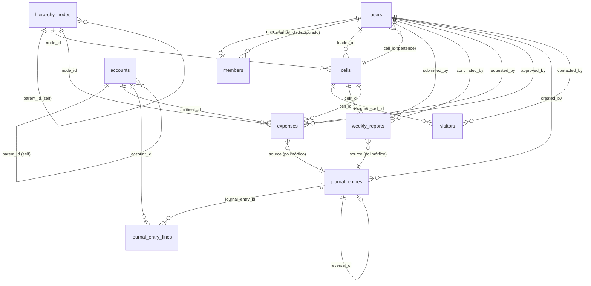

# Fase 1 — Banco de Dados & Models: MDA CHURCH ERP

## Migrations Geradas (ordem de execução)

| # | Arquivo | Tabela(s) | Nota |
|---|---------|-----------|------|
| 1 | `000001_create_hierarchy_nodes_table` | `hierarchy_nodes` | Auto-referencial (`parent_id`) |
| 2 | `000002_create_users_table` | `users`, `sessions`, `password_reset_tokens` | **Sem** `cell_id` ainda |
| 3 | `000003_create_cells_table` | `cells` | FK → `hierarchy_nodes`, FK → `users` |
| 4 | `000004_add_cell_id_to_users_table` | ALTER `users` | **Resolve dependência circular** |
| 5 | `000005_create_members_table` | `members` | 1:1 com `users`, `mentor_id` MDA |
| 6 | `000006_create_visitors_table` | `visitors` | Pipeline de evangelismo |
| 7 | `000007_create_weekly_reports_table` | `weekly_reports` | UNIQUE(`cell_id`, `report_date`) |
| 8 | `000008_create_accounts_table` | `accounts` | Plano de Contas NBC/SPED |
| 9 | `000009_create_expenses_table` | `expenses` | Workflow de aprovação |
| 10 | `000010_create_journal_entries_table` | `journal_entries` + `journal_entry_lines` | Partida Dobrada |

> [!IMPORTANT]
> Antes de rodar `php artisan migrate`, **remova ou renomeie** as migrations padrão do Laravel (`0001_01_01_000000_create_users_table.php`, etc.) para evitar conflito com a migration `000002`.

## Grafo de Relacionamentos



## Decisões de Arquitetura

### 1. Dependência Circular `users ↔ cells`
`cells.leader_id → users` e `users.cell_id → cells` criariam um deadlock de criação.
**Solução:** `users` é criada **sem** `cell_id`, depois `cells` é criada, e a FK `cell_id` é adicionada via migration separada (`000004`).

### 2. Contabilidade em Partida Dobrada (NBC TG 1000)
- `journal_entries` = cabeçalho do lançamento.
- `journal_entry_lines` = linhas Débito/Crédito (devem sempre ser iguais — validado por `JournalEntry::isBalanced()`).
- Suporte a **estorno** via `reversal_of` (auto-referencial).
- **Morfismo polimórfico** (`source_type` + `source_id`) permite que `WeeklyReport` e `Expense` gerem lançamentos automaticamente.

### 3. Workflow de Status
- `weekly_reports`: `Draft → Submitted → Conciliated`
- `expenses`: `Pending → Approved/Rejected → Paid`

### 4. Compliance LGPD
- Campo `cpf` na tabela `members` com `nullable` e `unique` — não obrigatório para cadastro inicial.

## Executar

```bash
# Remova as migrations padrão do Laravel antes
php artisan migrate --path=database/migrations
```

## Próxima Fase
**Fase 2:** Seeders (Plano de Contas padrão + usuário Admin) + Policies/Gates RBAC.
