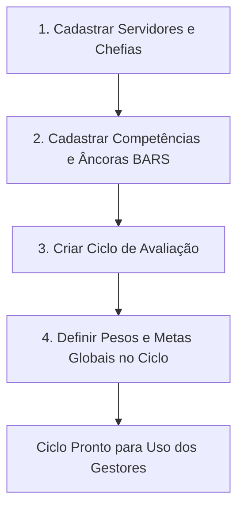

# Manual do Usuário e Guia de Parametrização
## Sistema de Avaliação de Desempenho Mista (BARS + Metas + Diário)

Este documento serve como o manual oficial e guia de parametrização do sistema de Avaliação de Desempenho Mista, desenvolvido para a administração pública. O sistema substitui notas numéricas subjetivas ("vazias") por uma abordagem científica e isonômica estruturada em três pilares integrados.

---

## 1. O Conceito da Metodologia Mista

A avaliação de servidores públicos tradicionalmente enfrenta dois problemas: a subjetividade das notas qualitativas e a dificuldade de gerir metas quantitativas descentralizadas. Para solucionar isso, o sistema implementa a **Metodologia Mista de Avaliação**:

1. **Competências Ancoradas em Comportamentos (BARS - Behaviorally Anchored Rating Scales)**: O avaliador não escolhe apenas um número de 1 a 5. Ele lê comportamentos reais descritos (âncoras) e seleciona aquele que melhor representa o desempenho do servidor.
2. **Metas Quantitativas Globais (Parametrizadas pelo RH)**: O RH define metas padronizadas por Ciclo de Avaliação. O gestor apenas informa o valor alcançado pelo servidor, garantindo isonomia matemática.
3. **Diário de Bordo do Servidor (Incidentes Críticos)**: Um registro contínuo e documentado de micro-feedbacks (fatos positivos 👍 ou negativos 👎) lançados ao longo do ano que servem como evidência empírica obrigatória para justificar notas altas ou baixas.

---

## 2. Guia de Parametrização Inicial (Perfil: RH / Administrador)

A parametrização correta pelo RH é o alicerce para que o sistema funcione com segurança jurídica e isonomia. O fluxo de parametrização segue a ordem abaixo:

### A. Cadastro e Configuração de Servidores
No menu **Gestão de Usuários** (`/admin/users`), o RH deve manter o cadastro dos servidores atualizado:
* **Perfis de Acesso**:
  * **Admin**: Servidores do RH com acesso completo a configurações, auditoria e cadastros de ciclos.
  * **Supervisor**: Chefias imediatas que terão permissão para lançar incidentes no Diário de Bordo e realizar as avaliações dos servidores sob sua lotação.
  * **Leader / Colaborador**: Servidores que serão avaliados e que terão acesso apenas para visualizar suas próprias notas e feedbacks.
* **Grupo de Avaliação (Categoria)**: Classifica o servidor de acordo com a sua área (Ex: `saude`, `guarda`, `administrativo`, `geral`). Isso determina quais perguntas de competências serão aplicadas a ele.
* **Trava Judicial de PAD**: O campo **has_active_pad** deve ser marcado como `Sim` caso o servidor responda a um Processo Administrativo Disciplinar ativo. Isso bloqueia automaticamente qualquer início ou salvamento de avaliação, resguardando a legalidade.

### B. Configuração do Banco de Competências (BARS)
No menu **Perguntas de Avaliação** (`/admin/evaluation-questions`), o RH parametriza o que será avaliado:
1. Cria-se a Competência (Ex: *Qualidade do Trabalho*, *Assiduidade*).
2. Vincula-se a competência a um **Grupo de Avaliação** (ou deixa-se como "Geral" para todos).
3. Configuram-se as **5 Âncoras Comportamentais (BARS)**: Cada nível de nota (1 a 5) deve ter a descrição do comportamento esperado.
   * *Exemplo para Assiduidade:*
     * **Nota 1**: Frequentes atrasos injustificados e faltas recorrentes que comprometem a equipe.
     * **Nota 3**: Cumpre o horário estabelecido regularmente, justificando eventuais atrasos com antecedência.
     * **Nota 5**: Pontualidade exemplar, serve como referência para a equipe e antecipa necessidades de escalas.

### C. Configuração do Ciclo de Avaliação e Metas Globais
No menu **Ciclos de Avaliação** (`/admin/evaluation-cycles`), o RH parametriza o período avaliativo:
1. **Dados Gerais**: Nome do ciclo (ex: "Avaliação Anual 2026"), data de início, data de fim e a Nota de Corte (nota mínima para aprovação ou promoção do servidor).
2. **Pesos das Competências**: O RH define a importância de cada competência no cálculo final qualitativo (Ex: *Responsabilidade* peso 2.0, *Iniciativa* peso 1.0).
3. **Metas Quantitativas Globais (Centralização)**: Nesta seção, o RH cadastra as metas que serão aplicadas de forma uniforme para todos os servidores avaliados no ciclo.
   * Clique em **Adicionar Meta**.
   * Insira a **Descrição** (ex: *Processos Analisados e Concluídos*).
   * Defina a **Métrica** (ex: *Processos*).
   * Defina o **Alvo Pactuado** (ex: *100*).
   * Defina o **Peso** desta meta no cálculo das metas (ex: *1.0*).

---

## 3. Manual do Avaliador (Perfil: Chefia / Supervisor)

O Supervisor utiliza o sistema no dia a dia para acompanhar o desempenho e, ao final do ciclo, preencher a avaliação de seus subordinados diretos.

### A. Registro de Incidentes Críticos (Diário de Bordo Contínuo)
Para evitar que a avaliação dependa apenas da memória recente do gestor na época de fechar as notas, o Supervisor deve lançar incidentes ao longo do ano:
1. No **Dashboard Principal**, localize o widget **Micro-feedbacks (Diário de Bordo)**.
2. Selecione o **Servidor**.
3. Selecione a **Categoria** da competência relacionada ao fato.
4. Escolha o tipo de incidente:
   * 👍 **Positivo**: Comportamentos exemplares que superaram as expectativas.
   * 👎 **Negativo**: Desvios ou comportamentos que precisam de correção.
5. Descreva o fato detalhadamente (o que aconteceu, quando e qual foi o impacto).
6. Clique em **Registrar no Diário**. Isso gerará uma evidência imutável e auditada na linha do tempo do servidor.

### B. Realizando a Avaliação de Desempenho
Quando o período de avaliações for iniciado pelo RH:
1. No menu principal, clique em **Nova Avaliação** (ou clique em **Avaliar** diretamente na lista de servidores do Dashboard).
2. Selecione o **Ciclo Ativo**, a **Lotação** e o **Servidor** a ser avaliado. O sistema verificará se o servidor possui PAD ativo (se tiver, bloqueará o início).
3. Na tela de preenchimento, o gestor passará por três seções:

#### Passo 1: Avaliação de Competências (BARS)
* Para cada competência, deslize o seletor ou clique no botão numérico de 1 a 5.
* **Comportamento Dinâmico**: Ao selecionar a nota, o texto da âncora comportamental correspondente cadastrada pelo RH aparecerá na tela. **Não dê nota sem ler o comportamento associado!**
* **Painel Lateral do Diário de Bordo (Evidências)**: No canto direito da tela, clique no botão para abrir o Diário de Bordo do Servidor. Você visualizará a timeline de todos os incidentes que registrou para ele ao longo do ano.
* **Vincular Incidente**: Arraste ou clique no botão de vincular de um incidente para associá-lo à competência avaliada.
  > [!WARNING]
  > **Justificativa Obrigatória**: Para notas extremas (**1, 2 ou 5**), o sistema exige obrigatoriamente um incidente do Diário de Bordo vinculado ou uma justificativa textual detalhada. Nota sem embasamento empírico não será salva pelo sistema.

#### Passo 2: Metas Quantitativas Globais
* Você verá a tabela de metas pré-carregada conforme configurada pelo RH.
* Os campos *Descrição*, *Métrica*, *Alvo Pactuado* e *Peso* estarão cinzas e bloqueados para edição (`readonly`).
* Digite o **Valor Alcançado** pelo servidor na respectiva coluna (ex: se a meta era analisar 100 processos e ele analisou 90, digite `90`).

#### Passo 3: Fechamento e Submissão
* Clique em **Salvar Rascunho** se quiser continuar depois, ou em **Submeter Avaliação** para fechar.
* Ao submeter, a nota final mista será calculada e gravada e o processo será concluído.

---

## 4. Manual do Servidor Avaliado (Perfil: Leader / Colaborador)

O servidor tem papel ativo na transparência e no próprio desenvolvimento.
1. Ao acessar o sistema com seu login, ele visualizará seu **Dashboard Individual**.
2. **Visualizar Diário de Bordo**: O servidor pode acompanhar todos os incidentes (positivos e negativos) registrados por sua chefia na sua linha do tempo, permitindo a ciência imediata de pontos fortes e de melhorias necessárias.
3. **Visualizar Avaliações Concluídas**: Ao final do ciclo, o servidor poderá ver o relatório completo de sua avaliação:
   * Notas de cada competência e as âncoras comportamentais correspondentes selecionadas.
   * Evidências vinculadas de seu Diário de Bordo.
   * Nível de atingimento das metas quantitativas.
   * Nota Final Mista ponderada e se atingiu a nota de corte estipulada pelo RH.

---

## 5. Regras de Negócio e Fórmulas de Cálculo

A Nota Final Mista é calculada de forma ponderada e normalizada em uma escala de **1.0 a 5.0**.

### A. Cálculo da Nota de Competências ($N_{comp}$)
É a média ponderada das notas atribuídas às competências BARS:

$$N_{comp} = \frac{\sum (Nota_{categoria} \times Peso_{categoria})}{\sum Peso_{categoria}}$$

### B. Cálculo da Nota de Metas Quantitativas ($N_{metas}$)
Para cada meta cadastrada pelo RH, calcula-se o percentual de atingimento:

$$Atingimento = \frac{Valor\ Alcançado}{Valor\ Alvo}$$

O atingimento de cada meta é limitado entre **0% (0.0) e 100% (1.0)** no cálculo para evitar distorções (por exemplo, um servidor que atinge 300% em uma meta compensar de forma desproporcional o não atingimento absoluto de outras).

A nota de atingimento consolidada das metas ($A_{consolidado}$) é a média ponderada dos atingimentos individuais:

$$A_{consolidado} = \frac{\sum (Atingimento_{meta} \times Peso_{meta})}{\sum Peso_{meta}}$$

Por fim, a taxa de atingimento consolidada (0 a 1) é convertida linearmente para a escala avaliativa do sistema de **1.0 a 5.0**:

$$N_{metas} = 1.0 + (A_{consolidado} \times 4.0)$$

### C. Cálculo da Nota Final Mista ($Nota_{final}$)
A Nota Final Mista é a composição ponderada das duas notas anteriores. Por padrão, o sistema utiliza peso igual de **50% para competências BARS** e **50% para metas quantitativas**:

$$Nota_{final} = (N_{comp} \times 0.5) + (N_{metas} \times 0.5)$$

---

## 6. Recursos e Auditoria (Perfil: RH)

### Trilha de Auditoria (Logs de Atividade)
Todas as ações críticas do sistema geram registros automáticos na Trilha de Auditoria (`/admin/logs`). O RH pode auditar:
* Quem criou, atualizou ou excluiu um ciclo de avaliação.
* Lançamentos rápidos de incidentes no Diário de Bordo.
* Submissão e notas finais das avaliações realizadas por cada supervisor.
* Ip, data e hora de cada transação, assegurando blindagem contra fraudes.
